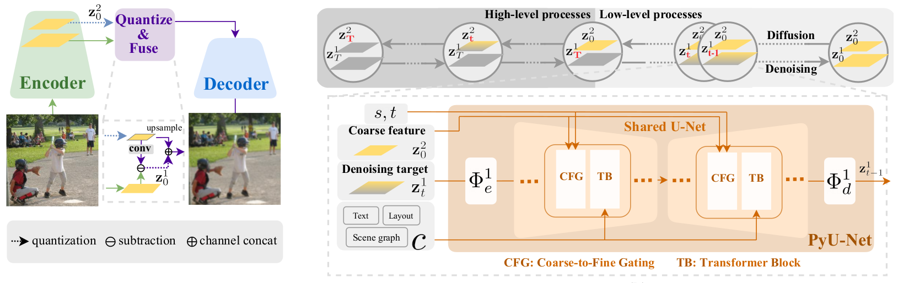
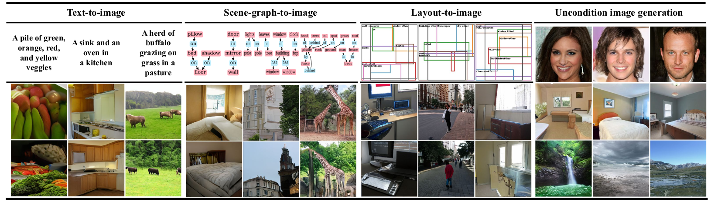

# *Frido*: Feature Pyramid Diffusion for Complex Scene Image Synthesis


This is the official repository of [Frido](https://arxiv.org/abs/2208.13753). We now support training and testing for text-to-image, layout-to-image, scene-graph-to-image, and label-to-image on COCO/VG/OpenImage. Please stay tune there!




[**Frido: Feature Pyramid Diffusion for Complex Scene Image Synthesis**](https://arxiv.org/abs/2208.13753)
<br/>[Wan-Cyuan Fan](https://sites.google.com/view/wancyuanfan), [Yen-Chun Chen](https://github.com/ChenRocks), DongDong Chen, Yu Cheng, Lu Yuan, Yu-Chiang Frank Wang<br/>

---
## ☀️News

We provide a web version of demo [here](https://sites.google.com/view/wancyuanfan/projects/frido) to help researchers to better understand our work. This web demo contains multiple animations to explain th diffusion and denoising processes of **Frido** and more qualitative experimental results. Hope it's useful!

---
## 🐧TODO

### Frido x Diffuser
- [ ] Merge with 🤗diffuser
- [ ] Live demo on Huggingface!

### Frido codebase
- [x] Training code
- [x] Training scrpits
- [x] Inference code
- [x] Inference scripts
- [x] Inference model weights setup
- [X] Evaluation code and scripts
- [X] Auto setup datasets
- [X] Auto download model weights
- [X] PLMS sampling tools
- [X] Web demo and framework animation
- [ ] Fix backward issue in PytorchLightning

---
## Machine environment
- Ubuntu version: 18.04.5 LTS
- CUDA version: 11.6
- Testing GPU: Nvidia Tesla V100
---

## Requirements
A [conda](https://conda.io/) environment named `frido` can be created and activated with:

```bash
conda env create -f environment.yaml
conda activate frido
```
---

## Datasets setup
We provide two approaches to set up the datasets:
### 🎶 Auto-download
To automatically download datasets and save it into the default path (`../`), please use following script:
```bash
bash tools/datasets/download_coco.sh
bash tools/datasets/download_vg.sh
bash tools/datasets/download_openimage.sh
```
### 🎶 Manual setup

#### COCO 2014 split (T2I)
- We use COCO 2014 splits for text-to-image task, which can be downloaded from [official COCO website](https://cocodataset.org/#download).
- Please create a folder name `2014` and collect the downloaded data and annotations as follows.

   <details><summary>COCO 2014 file structure</summary>

   ```
   >2014
   ├── annotations
   │   └── captions_val2014.json
   │   └── ...
   └── val2014
      └── COCO_val2014_000000000073.jpg
      └── ... 
   ```

   </details>


#### COCO-stuff 2017 
##### Standard split (Layout2I & Label2I)
- We follow [TwFA](https://openaccess.thecvf.com/content/CVPR2022/papers/Yang_Modeling_Image_Composition_for_Complex_Scene_Generation_CVPR_2022_paper.pdf) and [LAMA](https://openaccess.thecvf.com/content/ICCV2021/papers/Li_Image_Synthesis_From_Layout_With_Locality-Aware_Mask_Adaption_ICCV_2021_paper.pdf) to perform layout-to-image experiment on COCO-stuff 2017, which can be downloaded from [official COCO website](https://cocodataset.org/#download).
- Please create a folder name `2017` and collect the downloaded data and annotations as follows.

   <details><summary>COCO-stuff 2017 split file structure</summary>

   ```
   >2017
   ├── annotations
   │   └── captions_val2017.json
   │   └── ...
   └── val2017
      └── 000000000872.jpg
      └── ... 
   ```

   </details>

##### Segmentation challenge split (Layout2I & SG2I)
- We follow [LDM](https://arxiv.org/pdf/2112.10752.pdf) and [HCSS](https://arxiv.org/pdf/2105.06458.pdf) to perform layout-to-image experiment on COCO-stuff segmentation challenge split, which can be downloaded from [official COCO website](https://cocodataset.org/#download).
- Please make sure the `deprecated-challenge2017` folder is downloaded and saved in `annotations` dir.
- Please create a folder name `2017` and collect the downloaded data and annotations as follows.

   <details><summary>COCO 2017 Segmentation challenge split file structure</summary>

   ```
   >2017
   ├── annotations
   │   └── deprecated-challenge2017
   │        └── train-ids.txt
   │        └── val-ids.txt
   │   └── captions_val2017.json
   │   └── ...
   └── val2017
      └── 000000000872.jpg
      └── ... 
   ```

   </details>

#### Visual Genome (Layout2I & SG2I)
- We follow [TwFA](https://openaccess.thecvf.com/content/CVPR2022/papers/Yang_Modeling_Image_Composition_for_Complex_Scene_Generation_CVPR_2022_paper.pdf) and [LAMA](https://openaccess.thecvf.com/content/ICCV2021/papers/Li_Image_Synthesis_From_Layout_With_Locality-Aware_Mask_Adaption_ICCV_2021_paper.pdf) to perform layout-to-image experiments on Visual Genome.
- Also, we follow [Sg2Im](https://arxiv.org/abs/1804.01622) and [CanonicalSg2Im](https://roeiherz.github.io/CanonicalSg2Im/) to conduct scene-graph-to-image experiments on Visual Genome.
- Firstly, please use the download scripts in [Sg2Im](https://github.com/google/sg2im/tree/master/scripts) to download and pre-process the Visual Genome dataset.
- Secondly, Please use the script `TODO.py` to generate coco-style `vg.json` for both two tasks, as shown below:
```bash
python3 TODO.py [VG_DIR_PATH]
``` 
- Please create a folder name `vg` and collect the downloaded data and annotations as follows.

   <details><summary>Visual Genome file structure</summary>

   ```
   >vg
   ├── VG_100K
   │   └── captions_val2017.json
   │   └── ...
   └── objects.json
   └── train_coco_style.json
   └── train.json
   └── ...
   ```

   </details>

#### OpenImage (Layout2I)
- We follow [LDM](https://arxiv.org/pdf/2112.10752.pdf) and [HCSS](https://arxiv.org/pdf/2105.06458.pdf) to perform layout-to-image experiment on OpenImage, which can be downloaded from [official OpenImage website](https://storage.googleapis.com/openimages/web/download_v6.html).
- Please create a folder name `openimage` and collect the downloaded data and annotations as follows.

   <details><summary>OpenImage file structure</summary>

   ```
   >openimage
   ├── train
   │   └── data
   │   │    └── *.jpg
   │   └── labels
   │   │    └── masks
   │   │    └── detections.csv
   │   └── metadata
   │   │    └── classes.csv
   │   │    └── image_id.csv
   │   │    └── ...
   ├── validation
   │   └── data
   │   └── labels
   │   └── metadata
   └── info.json
   ```

   </details>


#### File structure for dataset and code
Please make sure that the file structure is the same as the following. Or, you might modify the config file to match the corresponding paths.

   <details><summary>File structure</summary>

   ```
   >datasets
   ├── coco
   │   └── 2014
   │        └── annotations
   │        └── val2014
   │        └── ...
   │   └── 2017
   │        └── annotations
   │        └── val2017
   │        └── ...
   ├── vg
   ├── openimage
   >Frido
   └── configs
   │   └── frido
   │   └── ... 
   └── exp
   │   └── t2i
   │        └── frido_f16f8_coco
   │             └── checkpoints
   │                  └── model.ckpt
   │   └── layout2i
   │   └── ...
   └── frido
   └── scripts
   └── tools
   └── ...
   ```

   </details>

---

## Download pre-trained models
The following table describs tasks and models that are currently available. 
To auto-download (using azcopy) all model checkpoints of Frido, please use following command: 
```bash
bash tools/download.sh
```
You may also download them manually from the download links shown below.

| Task                   | Dataset                     | FID    | Link (TODO) | Comments
| ---------------------- | -------------------------- | ------ | --- |-------------
| Text-to-image          | COCO 2014                  | 11.24  | [Google drive](https://github.com/davidhalladay/Frido/blob/main/tools/download.sh) |
| Text-to-image (mini)   | COCO 2014                  | 64.85  | [Google drive](https://github.com/davidhalladay/Frido/blob/main/tools/download.sh) |1000 images of mini-val; FID was calculated against corresponding GT images.
| Text-to-image          | COCO 2014                  | 10.74  | [Google drive](https://github.com/davidhalladay/Frido/blob/main/tools/download.sh) | CLIP encoder from stable diffusion (not CLIP re-ranking)
| Scene-graph-to-image   | COCO-stuff 2017                  | 46.11 | [Google drive](https://github.com/davidhalladay/Frido/blob/main/tools/download.sh) |Data preprocessing same as sg2im.
| Scene-graph-to-image   | Visual Genome                  | 31.61 | [Google drive](https://github.com/davidhalladay/Frido/blob/main/tools/download.sh) |Data preprocessing same as sg2im.
| Label-to-image   | COCO-stuff                  | 27.65 | [Google drive](https://github.com/davidhalladay/Frido/blob/main/tools/download.sh) | 2-30 instances
| Label-to-image   | COCO-stuff                  | 47.39 | [Google drive](https://github.com/davidhalladay/Frido/blob/main/tools/download.sh) | 3-8 instances
| Layout-to-image        | COCO (finetuned from OpenImage) | 37.14  | [Google drive](https://github.com/davidhalladay/Frido/blob/main/tools/download.sh) |FID calculated on 2,048 val images.
| Layout-to-image (mini) | COCO (finetuned from OpenImage) | 121.23 | [Google drive](https://github.com/davidhalladay/Frido/blob/main/tools/download.sh) |320 images of mini-val; FID was calculated against corresponding GT images.
| Layout-to-image        | OpenImage | 29.04 | [Google drive](https://github.com/davidhalladay/Frido/blob/main/tools/download.sh) | FID calculated on 2,048 val images.
| Layout-to-image        | Visual Genome | 17.24 | [Google drive](https://github.com/davidhalladay/Frido/blob/main/tools/download.sh) | DDIM 250 steps. Wegiths initialized from coco-f8f4.

> *The mini-versions are for quick testing and reproducing, which can be done within 1 hours on 1*V100. High FID is expected. To evaluate generation quality, full validation / test split needs to be run.*

> *FID scores were evaluated by using [torch-fidelity](https://github.com/toshas/torch-fidelity). The scores may slightly fluctuate due to the inherent initial random noise of diffusion models.*

---

## 🌲Inference Frido
We now provide scripts for testing Frido. 

### Quick Start
Please checkout the jupyter notebook [`demo.ipynb`](https://github.com/davidhalladay/Frido/blob/main/demo.ipynb) for a simple demo on text-to-image generation for COCO.


Once the datasets and model weights are properly set up, one may test Frido by the following commands.
### Text-to-image 
```bash
# for full validation:
bash tools/frido/eval_t2i.sh

# for mini-val:
bash tools/frido/eval_t2i_minival.sh

```
 - Default output folder will be `exp/t2i/frido_f16f8/samples`
### Layout-to-image

```bash
# for full validation:
bash tools/frido/eval_layout2i.sh

# for mini-val:
bash tools/frido/eval_layout2i_minival.sh
```
Default output folder will be `exp/layout2i/frido_f8f4/samples`

(Optional) You can modify the script by adding following augments. 

- -o [OUTPUT_PATH]  :  to change the output folder path.

- -c [INT]  :  number of steps for ddim and fastdpm sampling. (default=200)

### Multi-GPU testing

We provide code for multiple GPUs testing. Please refer to scripts of [`tools/eval_t2i_multiGPU.sh`](https://github.com/davidhalladay/Frido/blob/main/tools/eval_t2i_multiGPU.sh)

For example, 4-gpu inference can be run by the following.

```bash
bash eval_t2i_multiGPU.sh 4
```

---

## 🌱Train Frido
We provide some sample scripts for training Frido.

Once the datasets and model weights are properly set up, one may test Frido by the following commands.
### MS-VQGAN
```bash
bash tools/msvqgan/train_msvqgan_f16f8_coco.sh
```
 - Default output folder will be `exp_my/msvqgan/logs/msvqgan_f16f8_coco`
 - The sample script is tested on single V100. Please modify the batch-size and learning rate if using other types of GPU.
### Frido

```bash
bash tools/frido/train_t2i_f16f8_coco.sh
```
- Default output folder will be `exp_my/frido/t2i/logs/frido_f16f8_coco`

(Optional) You can modify the script by adding following augments. **bold** denotes default settings.
- -t [True/**False**] : to switch between training and testing mode. Note that this only support testing without classifier-free guidance (CFG). For CFG testing, please refer to [inference frido](#inference-frido).
- -log_dir [LOG_DIR_PATH] : to change the logs folder path.
- -scale_lr [**True**/False] : to allow model to auto-adjust learning rate by the total GPUs you used.
- -autoresume [**True**/False] : to enable auto-resume if detect existing checkpoints in log_dir.
- -save_top_k [INT] : Only save top K of model checkpoints based on monitor setting in the config. (default: **10**)
### Multi-GPU training

For multi-GPU training, please modify the augmentation of ```--gpus``` in the training scripts as follows.

For *single* GPU training, 
```bash
python main.py --base [CONFIGS] -t True --gpus 1 -log_dir [LOG_DIR] -n [EXP_NAME]
```
For *8* GPUs training, 
```bash
python main.py --base [CONFIGS] -t True --gpus 0,1,2,3,4,5,6,7 -log_dir [LOG_DIR] -n [EXP_NAME]
```

---

## Evaluation
### FID & SceneFID
FID scores were evaluated by using [torch-fidelity](https://github.com/toshas/torch-fidelity).

After running inference, FID score can be computed by the following command:
```bash
fidelity --gpu 0 --fid --input2 [GT_FOLDER] --input1 [PRED_FOLDER]
```
Example:
```bash
fidelity --gpu 0 --fid --input2 exp/t2i/frido_f16f8/samples/.../img/inputs --input1 exp/t2i/frido_f16f8/samples/.../img/sample
```
### CLIPscore

Please refer to EMNLP 2021 CLIPScore.

- paper: [CLIPScore: A Reference-free Evaluation Metric for Image Captioning](https://arxiv.org/abs/2104.08718) 
- GitHub:
[clipscore](https://github.com/jmhessel/clipscore)

### Detection score (YOLO)

We use YOLOv4 as pre-trained detector to calculate the detection score. Please refer to YOLOv4
- paper [YOLOv4](https://arxiv.org/abs/2004.10934)
- GitHub: [darknet](https://github.com/AlexeyAB/darknet) 

### IS/Precision/Recall

We use the scripts in ADM to calculate the IS, precision, and recall. 
- paper [ADM](http://arxiv.org/abs/2105.0523).
- GitHub: [guided-diffusion](https://github.com/openai/guided-diffusion) 

### PSNR/SSIM

To evaluate the reconstruction performance, we use the [PSNR](https://en.wikipedia.org/wiki/Peak_signal-to-noise_ratio) and [SSIM](https://en.wikipedia.org/wiki/Structural_similarity). The scripts can be found in the following python packages.
- GitHub: [image-similarity-measures](https://github.com/up42/image-similarity-measures) 


## Acknowledgement
We build Frido codebase heavily on the codebase of [Latent Diffusion Model (LDM)](https://github.com/CompVis/latent-diffusion) and [VQGAN](https://github.com/CompVis/taming-transformers). We sincerely thank the authors for open-sourcing! 

## Citation
If you find this code useful for your research, please consider citing:
```bibtex
@inproceedings{fan2022frido,
  title={Frido: Feature Pyramid Diffusion for Complex Scene Image Synthesis},
  author={Fan, Wan-Cyuan and Chen, Yen-Chun and Chen, Dongdong and Cheng, Yu and Yuan, Lu and Wang, Yu-Chiang Frank},
  booktitle={AAAI},
  year={2023}
}
```

## License

MIT
